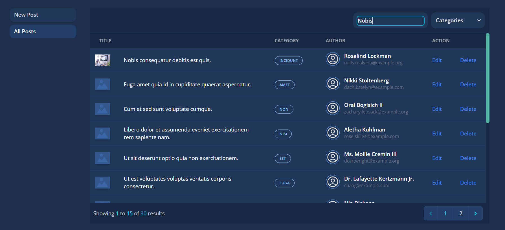
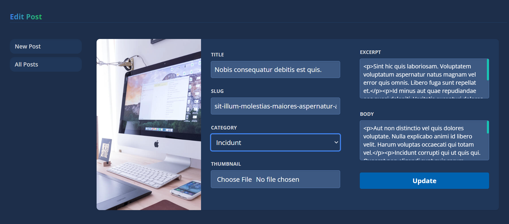
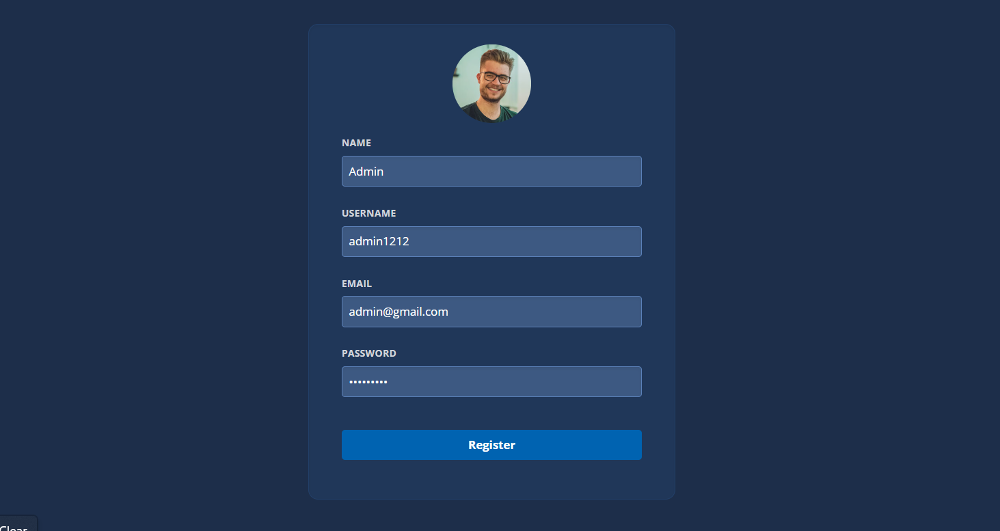
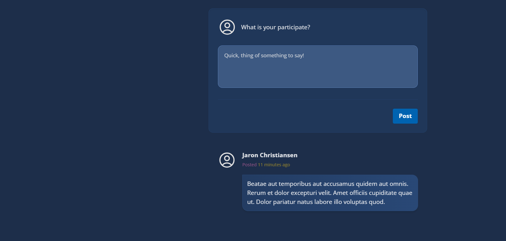

# Laravel Blog App with Vite and Tailwind CSS

A Laravel web application that enables users to manage blog posts with authentication features, including user registration and login. Styled using Vite and Tailwind CSS.

## Features

- **Post Management:** Create, read, update, and delete blog posts.
- **User Authentication:** Secure user registration and login system.
- **Relationships:** Establishes a relationship between posts and users.
- **Modern Frontend:** Styled using Vite and Tailwind CSS for a responsive and efficient user interface.


## Screenshots

### Admin Dashboard



### Post Management



### Register User



### Commenting on a Post (Registered User)




## Getting Started

Follow these instructions to get a copy of the project up and running on your local machine.

### Prerequisites

- Node.js installed on your machine

### Installation

1. Clone the repository:

   ```bash
   git clone https://github.com/your-username/laravel-blog-app.git

2. Navigate to the project directory:
   ```bash
   cd laravel-blog-app
3. Install Laravel dependencies:
   ```bash
   composer install
   
4. Create a copy of the .env.example file:
   ```bash
   cp .env.example .env
   
5. Configure the .env file with your database connection details and run:
   ```bash
   php artisan key:generate

6. Run database migrations and seeders:
   ```bash
   php artisan migrate --seed
   
7. Install Node.js dependencies and build assets:
   ```bash
   npm install
   npm run dev

## Usage

- Start the Laravel development server:
  ```bash
  php artisan serve

- Start the Vite development server for the frontend:
  ```bash
  npm run watch

  
- Open your browser and go to http://localhost:8000 to view the Laravel Blog App.
- Register a new user and log in to access post management features.

## Default Admin Credentials

For testing purposes, you can use the following default admin credentials to log in as an administrator:

- **Email:** admin@gmail.com
- **Password:** admin@123

Please note that these credentials are for testing purposes only and should be changed in a production environment.
